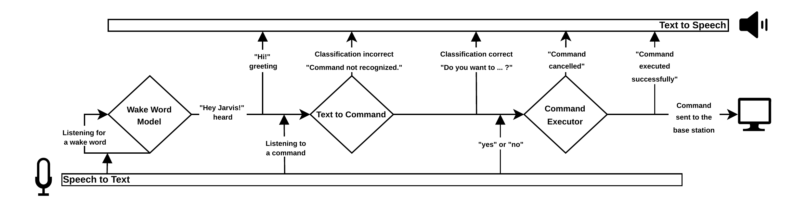

# Talk to Me, Jarvis: An Open-Source Edge-Deployable Voice Assistant Framework for Autonomous Racecars

Jarvis is a research voice assistant for issuing high-level autonomous-racing commands from a base station. It listens for “Hey Jarvis,” transcribes the next utterance, classifies it, speaks the proposed command, asks for confirmation, and publishes a ROS 2 message. It does **not** directly control a vehicle: state validation, safety checks, and forwarding to the racecar belong to the receiving base-station software.

The accompanying paper by Daniel Henel, Frederik Werner, Alexander Langmann, and Johannes Betz was accepted for ITSC 2026. It reports **97.63% classification accuracy** and **1.39 s average classifier processing time** for its recorded experiment. The [paper's notebook, data, prompt, and adapter](research/text_to_command/fine-tuning/paper/) are included for inspection. These figures describe the classifier experiment, not the complete spoken interaction or deployed Docker image.

## What runs in Docker

The [Dockerfile](docker/Dockerfile) uses ROS 2 Humble and Python 3.10. The [build script](docker/build_jarvis.sh) copies the adapter from `research/text_to_command/fine-tuning/latest/best_model/` and the prerecorded voice responses into the build context. During the image build, [download_models.py](docker/src/download_models.py) downloads the Mistral 7B base model, Whisper `base.en`, the `hey_jarvis_v0.1` wake-word model, and a Coqui VCTK/VITS voice model. The [container entrypoint](docker/src/jarvis.py) starts the Tk GUI and the ROS 2 node automatically. Once the models are present in the image, inference runs locally.



The running pipeline is:

1. openWakeWord detects “Hey Jarvis” from the microphone.
2. Whisper transcribes the operator's utterance.
3. The fine-tuned Mistral model returns **one command label**. The runtime separately extracts the first number from the transcription and detects speed units.
4. Prerecorded audio and Coqui TTS speak the proposed command and value; the Tk GUI shows the status.
5. The runtime listens for a spoken confirmation and, when its confirmation check accepts it, publishes to ROS 2.

The classifier does not return numeric values or ROS messages. `OTHER`, unsupported labels, and unrecognized output are treated as errors and are not published. `CRANK_REQUEST` exists in older research assets but is excluded by the running classifier.

## Supported commands

| Group | Command labels |
| --- | --- |
| Motion | `START`, `STOP` |
| Engine | `ENGINE_START`, `ENGINE_STOP` |
| Pit lane | `INTO_PITLANE_TOGGLE_ON`, `INTO_PITLANE_TOGGLE_OFF`, `STOP_IN_PITLANE_TOGGLE_ON`, `STOP_IN_PITLANE_TOGGLE_OFF` |
| Race control | `SPEED_BY_RC_TOGGLE_ON`, `SPEED_BY_RC_TOGGLE_OFF`, `FLAG_BY_RC_TOGGLE_ON`, `FLAG_BY_RC_TOGGLE_OFF` |
| Manual control | `JOYSTICK_TOGGLE_ON`, `JOYSTICK_TOGGLE_OFF` |
| Values | `SPEED_REQUEST`, `GG_SCALE` |

`SPEED_REQUEST` changes a target speed; it does not ask for current telemetry. It requires a detected number and a recognized km/h or m/s unit. The runtime converts km/h to m/s before publishing. `GG_SCALE` requires a number but no unit. If a required number or speed unit is missing, the request is rejected before confirmation.

## Build and run

Use a Linux host with Docker, an NVIDIA GPU and NVIDIA Container Toolkit, microphone and speaker access, an X11 display for the Tk GUI, and ROS 2 network connectivity to the receiving base station. A fresh Git LFS clone must contain the actual adapter weights rather than pointer files. Building the image needs internet access to download the base and speech models.

From the repository root:

```bash
git lfs pull
bash docker/build_jarvis.sh latest
```

This builds the local image `gitlab.lrz.de:5005/iac/jarvis:latest`; the script does not push it. The model downloader currently logs a failed base-model download without failing the entire build. Check that the image contains `/app/models/text_to_command/base_model/config.json` **and** the base-model weight files before running it.

For a **local Linux X11/PulseAudio desktop** with access to its display and PulseAudio socket, the following is a starting example. Set `XAUTHORITY` to the host's X11 authority file if it is not already set; audio or display permissions may need host-specific configuration.

```bash
export XAUTHORITY="${XAUTHORITY:-$HOME/.Xauthority}"
test -n "$DISPLAY" &&
test -r "$XAUTHORITY" &&
test -S "$XDG_RUNTIME_DIR/pulse/native" &&
docker run --rm -it \
  --gpus all \
  --network host \
  --device /dev/snd \
  -e DISPLAY="$DISPLAY" \
  -e XAUTHORITY=/tmp/.Xauthority \
  -v /tmp/.X11-unix:/tmp/.X11-unix:ro \
  -v "$XAUTHORITY:/tmp/.Xauthority:ro" \
  -e PULSE_SERVER=unix:/run/user/1000/pulse/native \
  -v "$XDG_RUNTIME_DIR/pulse/native:/run/user/1000/pulse/native" \
  -e ROS_DOMAIN_ID="${ROS_DOMAIN_ID:-0}" \
  gitlab.lrz.de:5005/iac/jarvis:latest
```

This is an example for that host setup, not a verified portable launch wrapper. The image built by the original GitLab `main` pipeline uses the `latest_main` tag; substitute that tag if running the CI-produced image. `--network host` allows ROS 2 discovery on the host network, and `ROS_DOMAIN_ID` must match the receiving ROS 2 system. The container's entrypoint launches Jarvis; no extra Python command is needed.

## ROS 2 output

The node publishes `std_msgs/msg/String` on the relative topic `voice_command` (normally `/voice_command` when no ROS namespace is set), with queue depth 10. There are no separate fields for a value, unit, or confirmation. After its confirmation check accepts the response, the runtime sets `String.data` as follows:

- For a command without a value: the label alone, such as `START`.
- For a value-changing command: three newline-separated lines: command label, value, and the literal word `CHANGE`.

For example, if the model selects `SPEED_REQUEST` from “set speed to 36 km/h,” the value sent is converted to m/s:

```text
SPEED_REQUEST
10.0
CHANGE
```

For “set GG scale to 0.8,” the message is:

```text
GG_SCALE
0.8
CHANGE
```

The runtime uses the **first** detected number in the utterance. It always writes `CHANGE` on the third line; it does not encode a separate increase/decrease mode or send the original spoken speed unit. A ROS 2 receiver on the same network and domain can inspect messages with `ros2 topic echo /voice_command`. The receiver must validate state and safety and decide whether to forward a command to the vehicle; no base-station subscriber or execution acknowledgement is included here.

The current confirmation code checks positive phrases as substrings before negative phrases. Some negative utterances can therefore be mistaken for approval. The GUI's “Command executed successfully” appears immediately after **publication**, without an acknowledgement from the base station.

## Research files

The [text-to-command research folder](research/text_to_command/) contains initial [online and local benchmarks](research/text_to_command/pre-fine-tuning/), [first-stage model selection](research/text_to_command/fine-tuning/first-stage/), and the final training artifacts. The paper's result is preserved in [`paper/`](research/text_to_command/fine-tuning/paper/); the adapter selected by Docker is in [`latest/`](research/text_to_command/fine-tuning/latest/). Each has its matching data and notebook. See the [comparison metadata](research/text_to_command/comparison.json) for the recorded experiment details.
